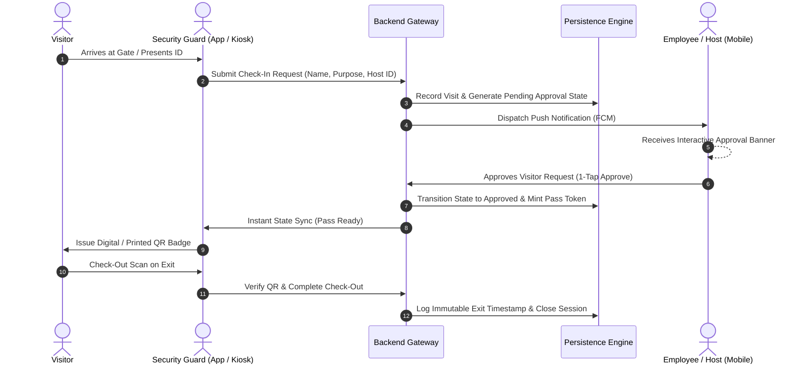

# System Architecture & Technical Design

## 1. High-Level Architecture Overview

The Gate Pass & Visitor Access Management System (STAGS) is an enterprise-grade access control ecosystem designed to modernize physical perimeter security, material transit tracking, and employee/visitor authentication.

The platform employs a modular multi-tier architecture separating the presentations (Responsive Web Dashboard & Native Android Mobile App), high-throughput business logic (RESTful API Gateway), and secure relational persistence.

```
+---------------------------------------------------------------------------------+
|                               Presentation Layer                                |
|                                                                                 |
|   +------------------------------------+   +--------------------------------+   |
|   |         React Web Portal           |   |      Native Android Client     |   |
|   | (TypeScript, Vite, Modern Design)  |   |   (Kotlin, Jetpack Compose)    |   |
|   | - Admin Configuration              |   | - Guard QR Scanner             |   |
|   | - Security Forensics & Analytics   |   | - Employee Host Approvals      |   |
|   | - Material & Asset Movement        |   | - Digital Passes & Badges      |   |
|   +-----------------+------------------+   +---------------+----------------+   |
+---------------------|--------------------------------------|--------------------+
                      |                                      |
                      | HTTPS / REST (JSON)                  | HTTPS / REST (JSON)
                      | Bearer Token Auth                    | Bearer Token Auth
                      v                                      v
+---------------------------------------------------------------------------------+
|                           API Gateway & Backend Layer                           |
|                                                                                 |
|   +-------------------------------------------------------------------------+   |
|   |                        Laravel 11 RESTful Engine                        |   |
|   |                                                                         |   |
|   |  - Token Authentication & Session Manager (Sanctum)                     |   |
|   |  - Multi-Tenant Organization Isolation Middleware                       |   |
|   |  - Role-Based Access Control (Super Admin, Guard, Host, Employee)       |   |
|   |  - Cryptographic Pass Token Generator & QR Verification Engine          |   |
|   |  - Firebase Cloud Messaging (FCM) Push Notification Dispatcher          |   |
|   |  - Event-Driven Audit & Forensic Timeline Logger                        |   |
|   +------------------------------------+------------------------------------+   |
+----------------------------------------|----------------------------------------+
                                         |
                                         | PDO / Eloquent ORM
                                         v
+---------------------------------------------------------------------------------+
|                               Persistence Layer                                 |
|                                                                                 |
|   +-------------------------------------------------------------------------+   |
|   |                      Relational Database (MySQL)                        |   |
|   |  - Organizations & Multi-Tenant Boundaries                              |   |
|   |  - Users, Roles, Permissions, & Device Tokens                           |   |
|   |  - Visitors, Hosts, Gate Passes, & Digital ID Cards                     |   |
|   |  - Material/Asset Records & Return Movement Tracking                    |   |
|   |  - Immutable Access Logs & Security Incident Audits                     |   |
|   +-------------------------------------------------------------------------+   |
+---------------------------------------------------------------------------------+
```

---

## 2. Component Architecture

### 2.1 Backend Services & API Gateway
- **Stateless RESTful Endpoints:** Standardized JSON contracts adhering to consistent resource envelopes (`status`, `data`, `meta`, `errors`).
- **Authentication & Token Lifecycle:** Secure token issuance with per-device scoping and revocation on logout or credential rotation.
- **Organization Isolation:** Multi-tenant database querying guarantees strict tenant separation across organizations, gates, and departmental boundaries.
- **Push Notification Service:** Dispatches high-priority push events to mobile host devices when guests register at gate kiosks.

### 2.2 Native Android Mobile Client
- **Architecture Pattern:** MVVM (Model-View-ViewModel) with Clean Architecture principles.
- **UI Framework:** Declarative UI with **Jetpack Compose** and Material 3 design specifications.
- **Scanner Engine:** Real-time QR and barcode ingestion using Google **CameraX** and ML Kit Vision API, processing optical tokens at 60 FPS without frame lag.
- **Secure Storage:** Token persistence utilizing platform-level **EncryptedSharedPreferences** backed by the Android Keystore.
- **State Synchronization:** Background event bus and reactive Kotlin Flows dynamically refresh pending approval counts and badge credentials.

### 2.3 Web Administration Portal
- **Architecture Pattern:** Single-Page Application (SPA) built with React and TypeScript.
- **Design System:** Custom component library emphasizing accessible contrast ratios, dynamic micro-interactions, responsive drawers, and data-dense tables.
- **Real-Time Dashboards:** Interactive occupancy gauges, live inside-personnel counts, and exportable audit registries.

---

## 3. Data Flow & Security Verification Lifecycle



---

## 4. Security Boundaries & Isolation Model

1. **Defense-in-Depth:** Every endpoint enforces authentication, authorization policies, and schema validation before hitting business logic.
2. **Cryptographic Token Verification:** QR passes encode non-guessable, time-bound UUID tokens validated against current occupancy rules.
3. **Audit Trail Immutability:** Sensitive security actions (overrides, blacklists, emergency lockouts) create uneditable audit events tagged with user ID, IP address, and timestamp.
